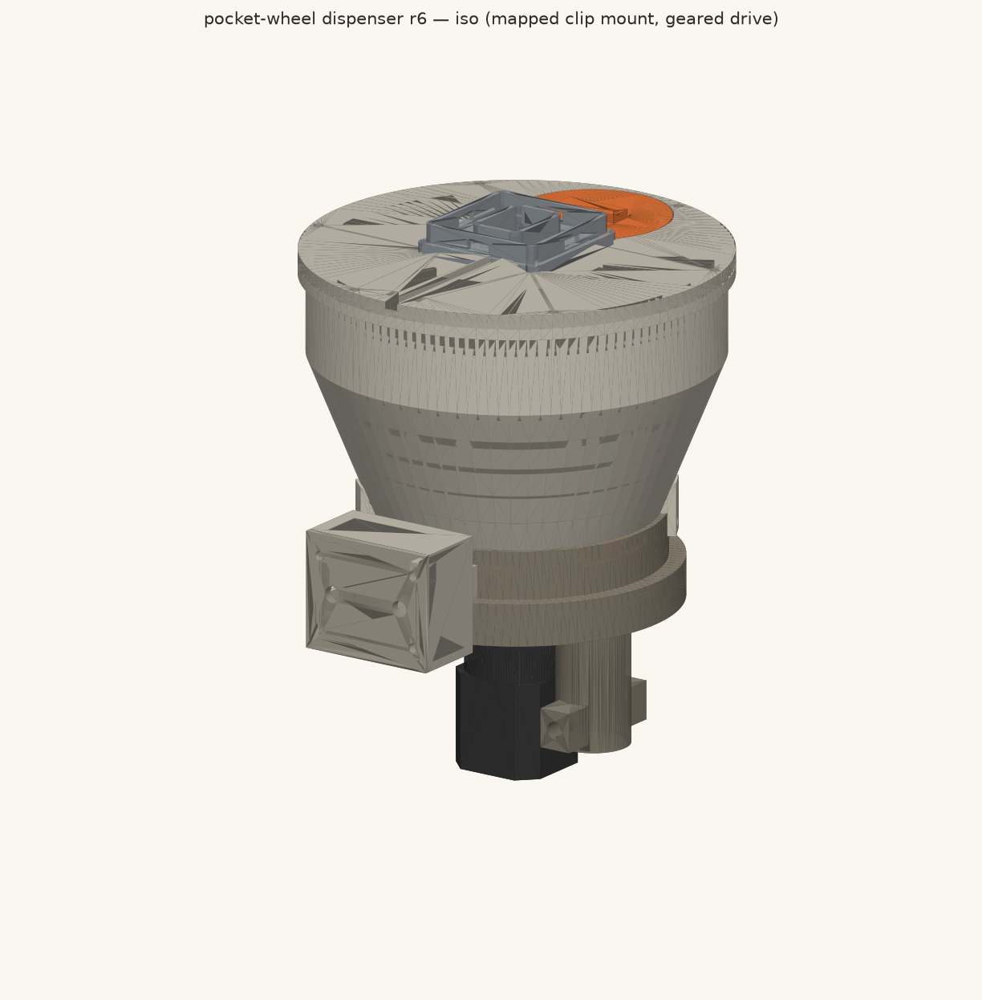

# Brush Bullet Dispenser

**Status:** design *(rev-0 design package — see [Open blockers](#open-blockers-read-before-building) below; this revision is **not** buildable as drawn)*
**Target port(s):** bottom (J31 — the only port with 12VSW)
**ICD version:** 1.0
**Champion:** thomasg
**Discussion:** —

## What it does

Carries herbicide brush-bullet pellets (Ø12 mm, 1.18 g, tebuthiuron/Spike-20P
class) under a Quiver and drops a commanded number of them — N ∈ 1..10, usually
1–3 — onto individual target plants during targeted brush control on West Texas
rangeland. Targets arrive as coordinates from an orthophoto/scouting pipeline;
the aircraft hovers at ~8 m AGL, commands `Dispense(seq, N)` over DroneCAN, and
the payload returns a **sensed** count of how many pellets actually left the
chute. Metering is a stepper-indexed 8-pocket disc: one pocket holds exactly one
pellet, so the count is bounded by geometry rather than by control, and an IR
through-beam in the exit chute closes the loop.

## Requirements

Requirements are captured in [`_run/CONTEXT.md`](_run/CONTEXT.md) (Thomas,
2026-08-06, verbatim directives). Headline compliance:

| | |
|---|---|
| Mass | **1.39 kg** loaded at the 250-pellet baseline (1.09 kg carried empty); 1.59 kg at the full 422-pellet brim |
| Power | **4.05 W peak / 0.34 A** — 3.57 W (0.298 A) from 12VSW while indexing, 0.48 W (0.040 A) from 12V_PL. Steady state, motor parked and count sensor watching: **0.40 W / 0.033 A** |
| Data | CAN2 (DroneCAN) — command + verified count. FMU_CH1 PWM — arm/disarm only. Ethernet **not used** |
| Port | bottom (J31) |
| Envelope | 150 × 165 × 195.4 mm below the mounting plane; 181.5 mm ground clearance at rest; 152.5 mm vertical / 251.1 mm in-plan clearance to the prop disks |

| Requirement (CONTEXT) | Target | Achieved | Verdict |
|---|---|---|---|
| Capacity | ≥250 pellets, more is better | 963 cm³ usable → **422** at worst-case barrel packing (587 on a sphere basis) | **PASS**, 1.69× — but see RT-5 below: the fill ribs are calibrated on a 40 % packing constant, so the "250" rib really holds ≈370 nominal pellets |
| Mass | ≤1.5 kg at the 250-pellet load | **1387.4 g** (100 %-infill ledger); ~1258–1285 g at 4 walls + 25–40 % infill | **PASS**, 113 g clear on the conservative basis |
| Count | exactly N, **verified (sensed)** | two staggered IR chord beams, 9.7–25 ms dark-time gate | **NOT MET in this revision** — the sensing that makes the claim true (ECO-3/ECO-9) exists only in `electronics/`, not in the CAD. See RT-3 |
| Accuracy | within 1 m from ~8 m AGL | ballistics say the payload is not the driver — 0.09 m drift per m/s of wind; hover hold is | **UNOWNED** — no sim was delivered. See RT-4/G1 |
| Fragment jam (2026-08-06 directive) | reject before wedge; shear as backstop; detect + recover | 25° entry ramp + 30° deflector nose + brush wiper; 20.4 N recovery vs 7.5 N to shear a Ø6 fragment (2.7×); Hall phase decode + bounded reverse-oscillate | **PARTIAL** — the r6 pellet-path critic constructed a fragment that lands in a 1.5–3.0 mm blind band and is defeated by *crushing*, not by rejection |
| Power ceiling | 2 A fuse on 12VSW | 0.298 A worst case, and a chopper's input current *falls* at stall | **PASS**, 6.7× |
| Scope | no software phase, no regulatory workstream | interface contract only (DSDL + semantics + timing) | honored |

## Open blockers (read before building)

This package is published at **rev-0 design** maturity with the CAD round's own
critic scores attached, not laundered. `cad/dispenser.py` last exported round 6,
which scored **interference 7 FAIL · pellet-path 5 FAIL · buildability 4 FAIL ·
mass-budget 8 PASS**. An independent red-team review reproduced three blockers
on the exported geometry. In the red team's words, the gate for calling this
rev-0 was that these be *closed or explicitly declared unmet in the README* —
this section is that declaration.

| # | Blocker | Measured | Owner |
|---|---|---|---|
| **RT-1** | **The mechanism cannot be assembled or driven as drawn.** Three independent geometry defects: the pocket-disc bore is a plain Ø6.12 round hole (r = 3.06 mm at all 24 probe angles) with **no D-flat**, so the gearbox D-cut transmits nothing and the grub screw is a buried blind hole with no path to the rim; the gearbox mounting holes are on a 26 mm **square** (r 16.8–19.9 on the diagonals) instead of the datasheet's Ø26 **bolt circle** (r = 13 on the axes); and the r6 entry-ramp cut was made with a half-space, mirroring a 25° undercut at θ = 310° and opening a **0.00 mm-thick through-slot** from the pellet bed into the metering arc downstream of every rejection feature | pocket_disc_r6.stl, retaining_plate_chute_r6.stl, meter_housing_r6.stl | round 7 CAD |
| **RT-2** | **There is no electrical connection to the aircraft.** Payload blind-mate pads sit at Z = −181.5 mm; the drone-side spring-pin tips are at Z = −162.15 mm → a **19.35 mm axial gap** against ≤2 mm of plunger travel. Even at the highest legal pad plane (−171.0) it is 8.85 mm. 10.5 mm of the gap is payload-controllable; the residual is aircraft/ICD-side and is **not closable in CAD**. Nothing downstream of it — count contract, power budget, DroneCAN — is real until a pin touches a pad | vendored 2112/3331 STEPs vs `dispenser_r6_assembly.step` | **escalate to the ICD owner** |
| **RT-3** | **"Verified count" is met on paper, not in geometry.** `electronics/ELECTRONICS.md` §4.2 proves a single centred beam has a disqualifying 5.2–14.7 ms dark-time spread; its fixes (ECO-3, two apertures at x = 29/35; ECO-9, 6 mm vertical stagger) were never merged into `cad/dispenser.py`, which still cuts one Ø3.2 tunnel per side on the bore diameter. `cad/BOM.md` still lists the TSSP4038 receiver that §4.4 rejects | `dispenser.py` L1005-1017 vs ELECTRONICS §4.3 | round 7 CAD + BOM |

Two further findings are called out here because they change what an operator
may do, not just what a builder must fix:

- **RT-5 — fill by mass, not by rib.** `PELLET_VOL_WORST = 2.28 mL/pellet`
  implies ~40 % packing; real spheres pack at ~0.60 random-loose. Filling to the
  "250" rib with nominal pellets gives **≈370 pellets / 438 g → ≈1530 g all-up**,
  *over* the 1.5 kg ceiling. Until the ribs are re-cut, **fill to 295 g on a
  scale**, not to a line inside an opaque black hopper. There is also no
  inventory telemetry at all — `lifetime_count` only, no `pellets_remaining`, no
  `Fill` service — so an empty hopper is discovered at a target, after that
  plant got a partial dose.
- **RT-6 — the black hopper is a thermal problem.** Parked-in-sun wall
  temperature computes to 77.5 °C against CF-PETG's 80 °C Tg, and the pellet
  binder softens in the same band. The BOM's carbon-filled (black) material
  directly contradicts ECO-1's α ≤ 0.4 finish requirement. Every structural
  check in the package is implicitly at room temperature.

The full 21-finding red team is in [`_run/RED-TEAM.md`](_run/RED-TEAM.md); the
7-gap coverage review is in [`_run/GAP-REVIEW.md`](_run/GAP-REVIEW.md); both are
folded into the risk register in [`docs/DESIGN.md`](docs/DESIGN.md) §7.

## Folder layout

- [`README.md`](README.md) — this file.
- [`docs/DESIGN.md`](docs/DESIGN.md) — the design story end to end: mechanism
  survey → trade study → six CAD rounds → electronics and interface contract →
  the sim that was not delivered → risk register.
- [`cad/`](cad/) — parametric build123d source (`dispenser.py`, 2597 lines),
  independent export checker (`verify_exports.py`), auto-generated
  [`BOM.md`](cad/BOM.md), `exports/` (STEP + STL, per-part and assembly, rounds
  1–6) and `renders/` (34 PNGs). Mating geometry and drone coordinates:
  [`interface/mechanical/`](../../interface/mechanical/).
- [`electronics/`](electronics/) — [`ELECTRONICS.md`](electronics/ELECTRONICS.md):
  power tree, actuator drive, count sensing, the DroneCAN command contract, BOM
  with prices, ECOs and the bench-test plan. **Design document only — no KiCad
  yet.** The blind-mate board is the pads-only Attachment Interface PCB, see
  [`interface/pcb/`](../../interface/pcb/).
- `sim/` — **not delivered.** See `docs/DESIGN.md` §6.
- `software/` — out of scope by direction (CONTEXT: *"NO software phase — that
  can be a whole project on its own"*). The electrical/command **contract** it
  would implement is specified in `electronics/ELECTRONICS.md` §5.
- [`_run/`](_run/) — run docs: research, concepts, judging, six rounds of build
  notes with verbatim critic output, red team, gap review. Not part of the
  shipped design; kept because the numbers in this README are traceable to it.

## Compliance

Against the ICD §8 checklist:

| Item | Status |
|---|---|
| Port capability | bottom port only — needs 12VSW, which no side port has |
| Mechanical mate | 4 × M2 SHCS at (±19, ±19) into the COTS 2112 payload-side clip plate. **Nonstandard:** the BOM's M2×10 gives only 0.90 mm of thread engagement in a 4 mm insert — **M2×14 required** (buildability MAJOR) |
| Envelope | within the 50 × 50 footprint above the plate face except the fill-cap wing bar (584 mm³, clears the drone-side plate underside by 7.35 mm) |
| Ground / prop clearance | 181.5 mm to ground (4.5× the ≥40 mm requirement); 152.5 mm vertical and 251.1 mm in-plan to the prop disks; zero plan overlap |
| Power | 0.298 A on 12VSW against a 2 A fuse (6.7×), cleared by the payload's own 0.60 A eFuse first; 0.040 A on 12V_PL against 25 W guidance (52×) |
| Blind-mate | **NONCOMPLIANT — see RT-2.** Pads do not reach the pins |
| CAN termination | none fitted, per ICD §4 |
| DroneCAN data-type IDs | **TBD** — must be allocated in the project-quiver DSDL registry; deliberately not invented here |
| Power cycling | tolerated by design: transaction-scoped, idempotent, resumable dispense with the count in FRAM; latched faults survive a 12V_PL cycle |
| **ICD change request raised** | **FMU_CH2 / K1 default state at FC boot is unspecified** (ELECTRONICS §2.8). The only non-firmware interlock on the rail that can release herbicide has undefined behaviour at FC boot, in-flight FC reboot, RC failsafe and parameter reset. Closure = a PR to project-quiver against ICD v1.0-draft §3. Until then the payload-side 100 kΩ EN pull-down is the sole compensation and is safety-critical |
