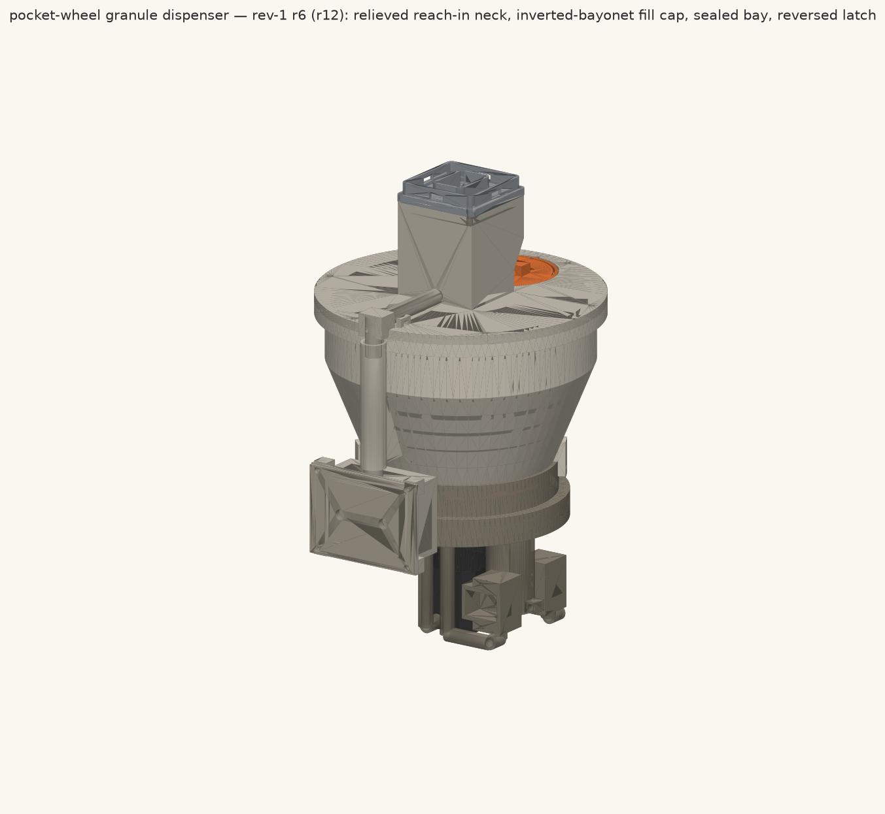

# Capsule Dispenser

**Status:** design complete at **export tag `r13`** (rev-1 close-out,
2026-08-10). Geometry verified by independent re-measurement; the disc print
hold is lifted. Not yet built or bench-tested; aircraft clearances await real
landing-gear geometry. Open items are listed under
[Verification status](#verification-status).

**Target port(s):** bottom (J31 — the only port with 12VSW)
**ICD version:** 1.0
**Champion:** thomasg
**Discussion:** —

## What it is

Carries herbicide capsule pellets (Ø12 mm, 1.18 g, tebuthiuron/Spike-20P
class) under a Quiver and drops a commanded number of them — N ∈ 1..10,
usually 1–3 — onto individual target plants during targeted brush control on
West Texas rangeland. Targets arrive as coordinates from an
orthophoto/scouting pipeline; the aircraft hovers at ~8 m AGL, commands
`Dispense(seq, N)` over DroneCAN, and the payload returns a **sensed** count
of how many pellets actually left the chute.

## How it works

- **Metering:** stepper-indexed 8-pocket disc at 45° pitch. One pocket holds
  exactly one pellet, so the count is bounded by geometry, not control. Drive
  is a 5.18:1 planetary-geared NEMA-14 (0.65 N·m at the disc); torque is
  carried by a D-bore on the shaft flat, with an M3 cup-point grub for axial
  retention (corridor from disc OD to the flat verified continuous at r13).
- **Counting:** two staggered IR through-beams in the exit chute (Ø3.2
  apertures, 6.0 mm stagger, PMMA windows, 9.7–25 ms dark-time gate). Count
  is stored in FRAM; dispense is transaction-scoped, idempotent, resumable
  through a power cycle.
- **Fragment handling:** reject-before-wedge nose (no gap a fragment can
  enter that the roof can't clear — max nose gap = min roof clearance =
  1.500 mm, no blind band), compliant bristles leading everything proud below
  5 mm, and crush-as-backstop: at Ø6 the measured section gives 2.00× the
  metering force and 1.20× recovery. A conforming shard beyond that stalls the
  drive — the intended failure mode (a whole pellet must never be milled).
  Recovery is Hall phase decode + bounded reverse-oscillate.
- **Refill:** dispenser comes off the aircraft (quick-release + blind-mate),
  stands on the `service_stand` GSE, fill cap on top. Capacity ≥250 pellets
  by requirement; the modelled hopper holds ~421 at worst-case barrel packing
  (~370 at the fill-rib's calibrated nominal).

## Specifications (r13)

| | |
|---|---|
| Mass | **1432.5 g** loaded at the 250-pellet baseline (slicer-realistic basis: 4 perimeters, 25 % infill), +68 g margin against the 1.5 kg cap; 1493.5 g with the 61 g open-item reserve; dry 1281.0 g. Per-part volumes reproduce off the exports to ≤0.04 %. Largest single uncertainty: the 350 g stepper is a vendor catalogue figure — weigh one |
| Power | 4.05 W / 0.34 A peak (3.57 W on 12VSW indexing + 0.48 W on 12V_PL); 0.40 W / 0.033 A steady watching. 2 A fuse → 6.7× headroom, payload's own 0.60 A eFuse clears first |
| Data | CAN2 (DroneCAN): `Dispense`, `ClearFault`, `SetMode`, `Result`/`Status` broadcasts. FMU_CH1 PWM: arm/disarm only. Ethernet unused |
| Envelope | 156 × 170 mm in plan, 247.4 mm below the mounting plane. Zero material above Z = −171.000 (mount plane) |
| Materials | CF-PETG structure, TPU agitator + chute plug, PMMA count windows; COTS per [`cad/BOM.md`](cad/BOM.md) |
| Actuator | StepperOnline 14HS13-0804S-PG5 (NEMA-14, 5.18:1 planetary), Ø6 D-cut shaft |

## Verification status

**Independently verified on the exports** (fresh-eyes re-measurement, OCP/
trimesh on the STEP/STL files — not the model's own checkers): torque path
incl. the r13 grub corridor (0.0000 mm³ obstruction to the shaft flat, with
the r12 disc reproduced as a failing control), bolt geometry, count-sensor
apertures/labyrinth/windows, reach-in corridors, rejection band, mass ledger,
export integrity (15/15 watertight, STEP↔STL ≤0.053 %).

**Carried from build notes, NOT independently reproduced — re-check before
flight:** ground clearance 129.4 mm, gear clearance 103.63 mm, prop clearance
152.55 mm vertical / 232.63 mm in-plan. No airframe/landing-gear STEPs exist
in any checkout to measure against; needs real geometry or calipers.

**Gated on bench tests (design assumptions, stated as such):**

| Gate | What it closes |
|---|---|
| B1 dark-time survey | the sensed-count claim (beams are in the CAD; the *claim* needs the bench) |
| IFDC S-115 crush test | σ = 0.36 MPa / µ = 0.4 carried in every jam number |
| Weigh one stepper | the 350 g catalogue figure (largest COTS mass) |

**Open engineering items:**

- **Release plateau (recorded, not closed):** pocket support is lost
  3.25–10.50° into the index at 6.7–10.7 mm separation (requirement was
  ≤1.0 mm) — published as measured; lateral velocity at release 0.126 m/s
- **Accuracy from 8 m AGL is unowned** — no ballistics/dispersion sim was
  delivered; drift ≈0.09 m per m/s wind says hover-hold is the driver
- **Blind-mate NONCOMPLIANT** (pads don't reach the pins — RT-2); DroneCAN
  data-type IDs TBD in the project-quiver DSDL registry
- **ICD change request open:** FMU_CH2/K1 default state at FC boot is
  unspecified; until closed, the payload-side 100 kΩ EN pull-down is the sole
  compensation and is safety-critical
- 19 BOM lines carry order-time TODO-VERIFY pins; the gearbox output-boss
  diameter needs a caliper check before printing the retaining plate;
  ELECTRONICS ECO-4 still says Ø6 × 1.0 for windows modelled Ø5.90 × 0.95

## Compliance (ICD §8)

| Item | Status |
|---|---|
| Port capability | bottom port only — needs 12VSW, which no side port has |
| Mechanical mate | 4 × M2×10 SHCS at (±19, ±19) into the COTS 2112 clip plate; grip 6.500 mm, 3.500 mm of thread into a 4.0 mm RX-M2×4 insert (87.5 %, ≥3.2 mm required) |
| Envelope | within the 50 × 50 footprint above the plate face except the fill-cap wing bar (584 mm³, clears the drone-side plate underside by 7.35 mm); 0.000 mm³ of payload above Z = −171.000 |
| Interface reach-in | PASS — 48 × 48 mm stand-off neck, three of four gloved-hand corridors at 0.0000 mm³ (−Y hopper side reads 321.2 mm³); quick-release actuation envelope not CAD-verifiable (drone-side half) |
| Ground / prop clearance | carried from build notes, not independently reproduced — see [Verification status](#verification-status) |
| Power | 0.298 A on 12VSW vs 2 A fuse (6.7×); 0.040 A on 12V_PL vs 25 W guidance (52×) |
| Blind-mate | **NONCOMPLIANT — RT-2.** Pads do not reach the pins |
| CAN termination | none fitted, per ICD §4 |
| DroneCAN data-type IDs | TBD — to be allocated in the project-quiver DSDL registry, deliberately not invented here |
| Power cycling | tolerated by design: transaction-scoped, idempotent, resumable dispense with the count in FRAM; latched faults survive a 12V_PL cycle |
| ICD change request | FMU_CH2/K1 boot-default unspecified (ELECTRONICS §2.8) — closure is a PR to project-quiver ICD v1.0-draft §3 |

## Folder layout

- [`README.md`](README.md) — this file: the dispenser as it currently is.
- [`BUILD.md`](BUILD.md) — how to build it: print settings, ordering gates,
  bench prep, the (forced) assembly sequence with QC checks, first-power and
  pre-flight gates.
- [`cad/`](cad/) — parametric build123d source (`dispenser.py`; the model
  prints its full check suite on every build), auto-generated
  [`BOM.md`](cad/BOM.md), current close-out checker
  (`verify_r13_closeout.py`), `exports/` (r13 STEP/STL set) and `renders/`.
  Mating geometry: [`interface/mechanical/`](../../interface/mechanical/).
- [`electronics/`](electronics/) —
  [`ELECTRONICS.md`](electronics/ELECTRONICS.md): power tree, drive, count
  sensing, DroneCAN contract, priced BOM, ECOs, bench-test plan. Design
  document only — no KiCad yet.
- `software/` — out of scope by direction; the contract it would implement is
  ELECTRONICS §5. `sim/` — not delivered (see DESIGN §6).
- [`docs/DESIGN.md`](docs/DESIGN.md) — design rationale and evolution.
- [`_run/`](_run/) — the audit trail (research, trades, build rounds, critic
  output, independent verification, close-out records).

## Design history

This package was built over twelve CAD rounds plus a close-out, each round
independently critiqued, with a fresh-eyes verification of the final geometry
and a hand-executed r13 close-out. **None of that is needed to understand the
machine above** — but every number in this README traces to it. The story
lives in [`docs/DESIGN.md`](docs/DESIGN.md); the verification record in
[`_run/rev1/VERIFY.md`](_run/rev1/VERIFY.md),
[`_run/rev1/BUILD-NOTES-closeout-r13-r1.md`](_run/rev1/BUILD-NOTES-closeout-r13-r1.md)
and [`_run/rev1/RUN-RESULT.md`](_run/rev1/RUN-RESULT.md). Superseded numbers
from earlier revisions appear only there.
