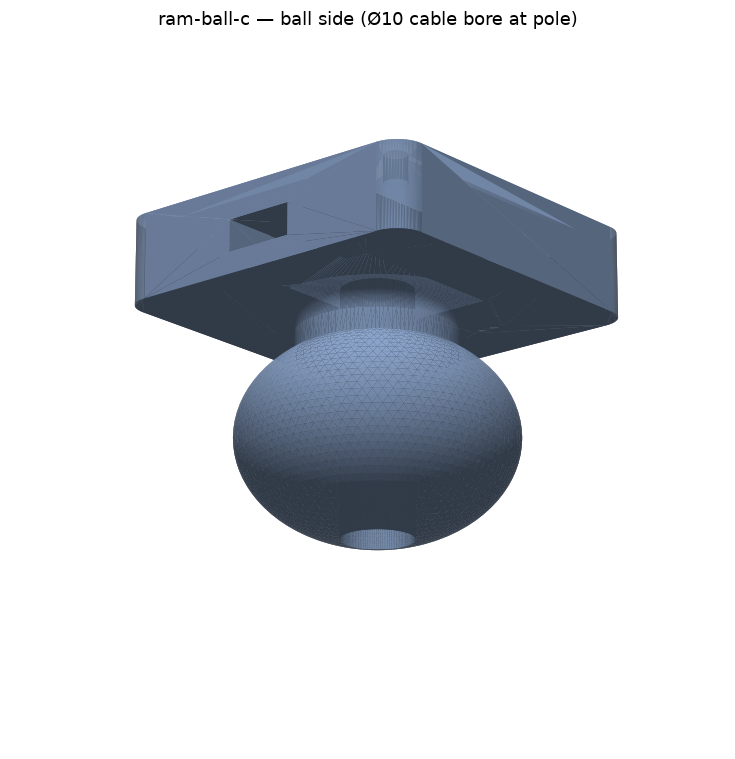

# RAM Ball C

**Status:** design
**Target port(s):** bottom / side 1 / side 2 (mechanical-only payloads work on any port)
**ICD version:** 1.0
**Champion:** Hex (Thomas's agent) / `@Hex` on Discord
**Discussion:** Discord thread *Quiver ram ball C*

One 3D-printed part that bolts to the payload-side quick-release clip plate
and exposes a **1.5" RAM Size-C ball**, so anything in the RAM ecosystem
(double-socket arms, cradles, cameras, antennas…) can hang off a Quiver
mounting point and be re-aimed without tools. Wiring from the blind-mate PCB
still comes through.

## What it does

Clips onto any Quiver port via the standard quick-release, presents a Size-C
ball pointing away from the aircraft (down on the bottom port, outboard on the
sides). Two wiring routes from the blind-mate PCB:

- **Side channel** — 10 × 6 mm slot from the PCB well out the −Y face.
- **Axial bore** — Ø10 mm straight down the neck and out the ball's bottom
  pole, for wiring that should arrive at the mounted device. The bore exits
  inside the pole cap (~15° half-angle), well clear of the band a RAM socket
  clamps (verified: surface solid ±45° around the equator).

## Requirements

| | |
|---|---|
| Mass | ~75 g printed (PETG, solid) + clip half + fasteners ≈ 150 g, before the RAM arm and device |
| Power | none itself; pass-through wiring only |
| Data | pass-through wiring only |
| Port | any |

Load guidance: RAM rates C-size arms to roughly 1–2 kg in vibration
environments; a printed PETG/ASA ball is the compliant element in the stack.
Keep the hung mass + arm well inside the platform's payload budget and treat
>1 kg on a printed ball as needing a pull test first (same logic as the
capsule dispenser's RT-13 retention test).

## Geometry provenance

Interface dims are **measured, not assumed** — they come from the
capsule-dispenser r6 containment scan of
[`2112_attach_plate_payload_side.step`](../../interface/mechanical/)
(see `capsule-dispenser/cad/dispenser.py`, "clip-plate map"; r5 of that
project bolted into the blind-mate window by trusting eyeballed numbers):

- mount pattern 4× M2 at (±19, ±19), Ø3.9 head-clearance columns in the plate
- blind-mate shaft 16 × 24 through the plate; the payload-side pads PCB
  mounts to the plate's own tabs and hangs below it
- clip plate 50 × 50 × 10.5 mm

The part's well (16.6 × 24.6 × 12 deep, sharp corners) swallows the PCB, its
Molex J1 and a service loop. The square mount pattern *could* be assembled
90° off — but then the plate's 16 × 24 shaft crosses the well and the PCB
lands on the well rim, so wrong assembly is physically blocked. Engraved
triangle on the +Y wall (apex toward the plate) marks aircraft-forward on
the bottom port.

## Build

- **Print:** PETG or ASA, 100 % infill (it's small; the ball and neck carry
  the load), 0.12–0.16 mm layers, ball-side up with the top face on the bed.
  The well roof and slot bridge ≤ 16 mm — no supports needed; supports OFF
  under the ball (the tangent neck keeps overhangs gradual).
- **Hardware:** 4× M2 heat-set inserts (Ruthex-type, Ø3.2 bore) into the top
  face; 4× **M2×12** ISO 4762 through the clip plate from the drone side
  (~2.9 mm thread engagement — M2×10 leaves under 1 mm, don't substitute);
  the COTS clip half itself (BOM 2112, see
  [`interface/mechanical/`](../../interface/mechanical/README.md)).
- A rigid printed ball grips fine in RAM arms but damps less than RAM's
  rubberized balls; if a device turns out vibration-sensitive, the fix is at
  the device end (RAM shock plate) or a marine-grade steel C ball on a
  50 × 50 AMPS adapter plate instead of this part.

## Folder layout

- `cad/ram_ball_c.py` — parametric source (build123d). Running it exports
  `ram_ball_c_adapter.stl` / `.step` next to itself.
- `cad/verify_ram_ball_c.py` — independent checks on the exports (trimesh
  containment + STEP face queries): envelope, insert pattern, well clear of
  the full board footprint, both cable paths, ball diameter, clamp-band
  integrity. All 12 pass on the committed exports.
- `cad/renders/` — preview renders.

## Compliance

ICD §8: mechanical-only payload; no power drawn, no CAN termination, no
network presence. Envelope: 48 × 48 mm footprint inside the 50 × 50 clip
plate, 58.6 mm tall below the mating plane — on the bottom port the ball
bottom sits at Z ≈ −230, far above landing-gear ground contact (≈ −548).
Nothing protrudes above the mating plane.
